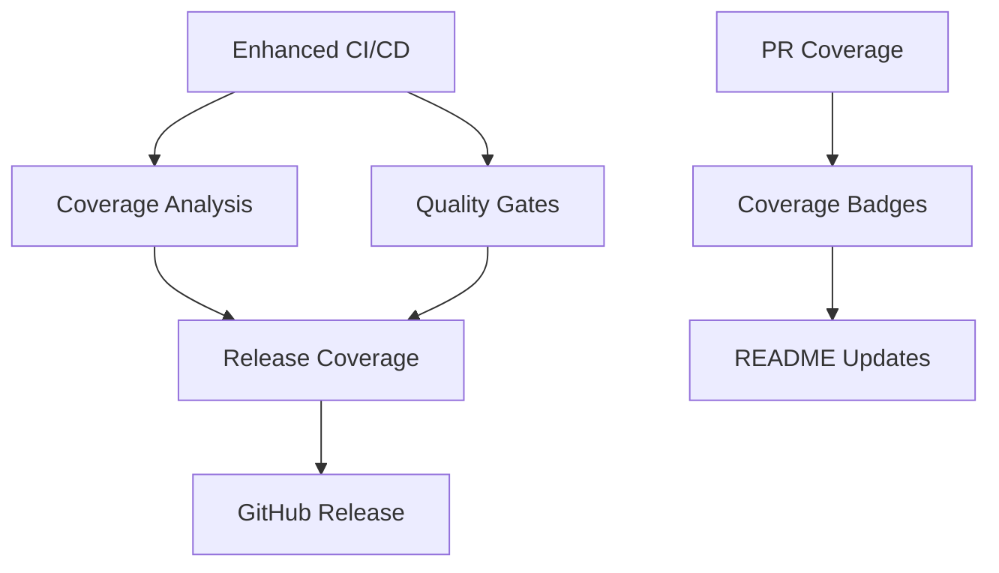

# GitHub Actions CI/CD Workflows

This directory contains comprehensive GitHub Actions workflows for the tx-builder project, providing production-ready CI/CD with extensive coverage reporting and quality gates.

## Workflow Overview

### 🔄 Core CI/CD Workflows

#### 1. **Enhanced CI/CD Pipeline** (`ci-enhanced.yml`)

**Trigger**: Push to main/develop, Pull requests\
**Purpose**: Complete multi-platform testing and build validation

**Features**:

- Node.js matrix testing (18.x, 20.x, 21.x)
- Deno 2.x compatibility testing
- TypeScript type checking
- ESLint validation
- Build verification
- Integration testing
- Coverage collection
- Artifact management

**Key Jobs**:

- `setup` - Configuration validation
- `lint-and-format` - Code style checks
- `type-check` - TypeScript validation
- `test-node` - Node.js testing across versions
- `test-deno` - Deno testing and compatibility
- `build` - Package building and verification
- `integration-tests` - End-to-end validation
- `coverage-consolidation` - Coverage report aggregation
- `final-status` - Overall pipeline status

#### 2. **Coverage Analysis** (`coverage.yml`)

**Trigger**: Push to main/develop, Pull requests\
**Purpose**: Comprehensive coverage analysis and reporting

**Coverage Thresholds**:

- **Statements**: 85% minimum
- **Branches**: 80% minimum
- **Functions**: 85% minimum
- **Lines**: 85% minimum
- **Core modules**: 90% minimum
- **Encoders modules**: 90% minimum
- **Selectors modules**: 90% minimum

**Features**:

- Real-time coverage threshold validation
- Module-specific coverage checking
- HTML and LCOV report generation
- Codecov integration
- PR comment with coverage details
- Deno coverage analysis
- Coverage diff analysis for PRs

#### 3. **Quality Gates** (`quality.yml`)

**Trigger**: Push to main/develop, Pull requests\
**Purpose**: Code quality assurance and security scanning

**Quality Checks**:

- Security vulnerability scanning (npm audit)
- Dependency review for PRs
- TypeScript strict mode validation
- ESLint error-free validation
- Deno lint and format checks
- Performance analysis
- Code complexity analysis
- Documentation coverage assessment

#### 4. **PR Coverage Analysis** (`pr-coverage.yml`)

**Trigger**: Pull request events\
**Purpose**: Detailed coverage analysis for pull requests

**Features**:

- Base vs PR coverage comparison
- File-level coverage analysis
- Uncovered lines identification
- Test analysis and validation
- UTXO protection test verification (129+ tests)
- Coverage trend analysis
- Automated PR comments with detailed reports

### 🚀 Release Workflows

#### 5. **Release with Coverage Validation** (`release-coverage.yml`)

**Trigger**: Version tags (v*), Manual dispatch\
**Purpose**: Production release with strict quality validation

**Release Thresholds** (Stricter than CI):

- **Statements**: 90% minimum
- **Branches**: 85% minimum
- **Functions**: 90% minimum
- **Lines**: 90% minimum

**Release Process**:

1. Pre-release coverage validation
2. UTXO protection test verification (129+ tests)
3. Multi-platform build testing
4. Deno compatibility validation
5. GitHub release creation
6. Artifact attachment
7. Release notes generation

#### 6. **Coverage Badges & Documentation** (`coverage-badges.yml`)

**Trigger**: Push to main, Daily schedule (6 AM UTC), Manual\
**Purpose**: Automated badge updates and documentation

**Generated Badges**:

- Overall coverage percentage
- Individual metric badges (statements, branches, functions, lines)
- Test count badges
- Platform compatibility badges
- TypeScript version badge

**Documentation Updates**:

- README badge integration
- Coverage documentation generation
- Coverage history tracking
- Quality metrics reporting

## Integration Features

### 📊 Coverage Reporting

**Multiple Report Formats**:

- HTML reports for detailed inspection
- LCOV format for external services
- JSON summaries for programmatic access
- Text summaries for quick reference

**External Integrations**:

- Codecov automatic uploads
- Badge generation and updates
- PR comments with coverage details
- Artifact storage for historical analysis

### 🔍 Quality Assurance

**Security Scanning**:

- npm audit for known vulnerabilities
- Dependency review for PR changes
- CVSS scoring and severity filtering

**Code Quality**:

- TypeScript strict mode validation
- ESLint with fail-on-error
- Deno formatting and linting
- Code complexity analysis
- Performance benchmarking

### 🧪 Testing Strategy

**Test Categories**:

- Unit tests with comprehensive coverage
- Integration tests with real APIs
- End-to-end transaction testing
- UTXO protection validation (129+ tests)
- Performance and stress testing

**Platform Testing**:

- Node.js 18.x, 20.x, 21.x compatibility
- Deno 2.x compatibility
- Cross-platform build verification

### 📈 Monitoring and Reporting

**Automated Reporting**:

- Coverage trend tracking
- Performance metrics
- Test execution statistics
- Build artifact sizes
- Dependency analysis

**PR Integration**:

- Automated coverage comments
- Quality gate status reporting
- Test analysis summaries
- Performance impact assessment

## Workflow Dependencies



## Configuration Files

### Required Scripts in package.json

```json
{
  "scripts": {
    "test:coverage": "vitest run --coverage",
    "test:integration": "vitest run tests/integration",
    "validate:final": "tsx src/validation/final-validation-summary.ts",
    "validate:imports": "tsx scripts/validate-import-maps.ts",
    "type-check": "deno check src/index.ts",
    "lint": "deno lint src/",
    "build": "tsup"
  }
}
```

### Required devDependencies

```json
{
  "devDependencies": {
    "@vitest/coverage-v8": "^2.1.8",
    "vitest": "^2.1.8",
    "typescript": "^5.3.3",
    "tsup": "^8.0.1"
  }
}
```

## Environment Variables

### GitHub Secrets

- `GITHUB_TOKEN` - Automatic (for releases)
- `CODECOV_TOKEN` - Optional (for Codecov integration)

### Coverage Thresholds

Configured in workflow files:

```yaml
env:
  COVERAGE_STATEMENTS: 85
  COVERAGE_BRANCHES: 80
  COVERAGE_FUNCTIONS: 85
  COVERAGE_LINES: 85
```

## Usage Examples

### Running Locally

```bash
# Run full CI pipeline locally
npm run test:coverage
npm run lint
npm run type-check
npm run build

# Run specific test suites
npm run test:unit
npm run test:integration
npm run test:e2e

# Generate coverage reports
npm run test:coverage
open coverage/index.html
```

### Manual Workflow Triggers

```bash
# Trigger coverage badge update
gh workflow run coverage-badges.yml

# Create manual release
gh workflow run release-coverage.yml -f version=v1.0.0
```

## Monitoring and Maintenance

### Daily Checks

- Coverage badge updates (automated at 6 AM UTC)
- Dependency security scanning
- Performance trend monitoring

### Weekly Reviews

- Coverage trend analysis
- Quality metrics assessment
- Test suite performance review

### Release Checklist

1. Ensure all CI workflows pass
2. Verify coverage thresholds met (90%+ for release)
3. Confirm UTXO protection tests (129+ tests)
4. Review security scan results
5. Validate multi-platform compatibility

## Troubleshooting

### Common Issues

**Coverage Threshold Failures**:

- Check test file coverage with `npm run test:coverage`
- Review HTML report for uncovered lines
- Add tests for uncovered code paths

**Build Failures**:

- Verify TypeScript compilation: `npm run type-check`
- Check ESLint errors: `npm run lint`
- Validate import maps: `npm run validate:imports`

**Test Failures**:

- Run tests locally: `npm test`
- Check integration test setup
- Verify environment configuration

### Workflow Debugging

```bash
# View workflow logs
gh run list --workflow=ci-enhanced.yml
gh run view [RUN_ID] --log

# Re-run failed jobs
gh run rerun [RUN_ID] --failed
```

## Future Enhancements

### Planned Features

- [ ] Automated security advisories
- [ ] Performance regression detection
- [ ] Cross-browser testing integration
- [ ] Automated dependency updates
- [ ] Enhanced reporting dashboards

### Integration Opportunities

- Sonarqube integration for code quality
- Snyk integration for advanced security scanning
- Performance monitoring with continuous benchmarking
- Automated changelog generation
